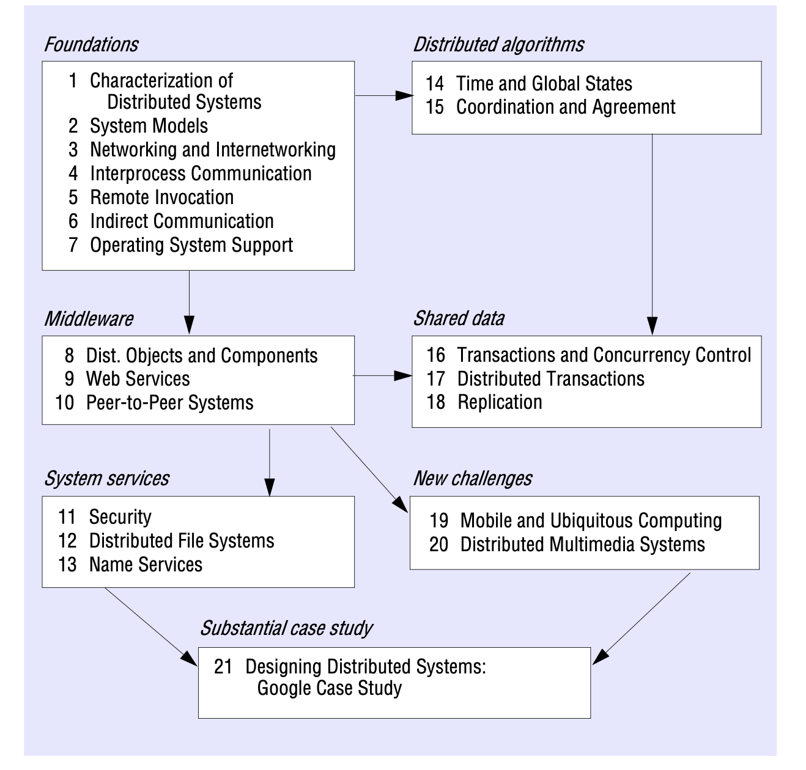

# CS6650_distributed_system

Distributed Systems Concepts and Design
全书架构

No global clock:
Independent failures:
Concurrency

1.5 Challenges

- Heterogeneity
  different computer system, different language
- Openness
- Security
- Scalability
- Failure handling
- Concurrency
- Transparency
- Quality of service
